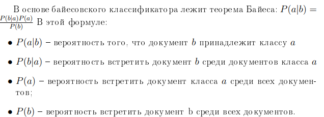
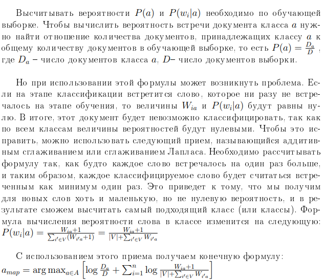

## Тема работы
  Построить наивный байесовский классификатор для распознавания тональности текста на языке Python(реализовать в виде класса). Подобрать или создать датасет и обучить модель. Продемонстрировать зависимость качества классификации от объема и качества выборки. Продемонстрировать работу вашего алгоритма.

## Отчет

  Классификация документа – это задача информационного
поиска. Заключается она в отнесении документа к одной или нескольким
категориям на основании содержимого. Классификация может
осуществляться целиком вручную, автоматически с помощью созданного
вручную набора правил или автоматически с применением методов
машинного обучения. В последнем случае могут использоваться разные
методы, например, решающие деревья, наивный байесовский
классификатор, нейронные сети, метод опорных векторов и другие.


В задаче классификации имеется выборка – множество
объектов с ивестным разбиением на классы. По этим
данным  собирается статистика, на ее основе в
дальнейшем происходит определение наиболее вероятного класса (или классов)
для других объектов.


Одним из самых распространенных алгоритмов классификации
являются байесовские классификаторы, и самым простым из них является
наивный байесовский классификатор. Он используется из-за легкости
имплементации, но при этом часто разница между ним и более
продвинутыми алгоритмами невелика. Достоинством этого классификатора
также является малое количество данных для обучения, необходимых для
оценки параметров, требуемых для классификации.






 На прежде чем приступить к классификации, необходимо обработать текст. Для каждого слова в тексте необходимо выделить главную часть. Так, например, словa 'link', 'linked' и 'linking' должны восприниматься как одно и то же слово. Чтобы отбрость ненужные части слов будем использовать стеммер.

Также необходимо очистить текст от слов без смысловой нагрузки: предлогов, местоимений и т.д..
   Разделим входные данные для обучения и проверки. А затем применим к полученным данным собственную реализацию классификатора, а также библиотечную, в результате чего получим следующие результаты:
```python
My implementation accuracy score = 0.8216666666666667

Lib implementation accuracy_score = 0.82

```

## Выводы
  Выполнять лабораторную работу было просто и интересно благодаря удобству интерфейса используемых библиотек.
  Байесовский классификатор называется наивным, так как он полностью игнорирует контекст и представляет документ как набор слов вероятности которых условно не зависят друг от друга. Такой подход называется bag of words model.
  Другой важной деталью является то, что реализованный алгоритм не уступает по точности аналогичному из библиотеки sklearn. А на представленном примере смог добиться большей точности. 
 
